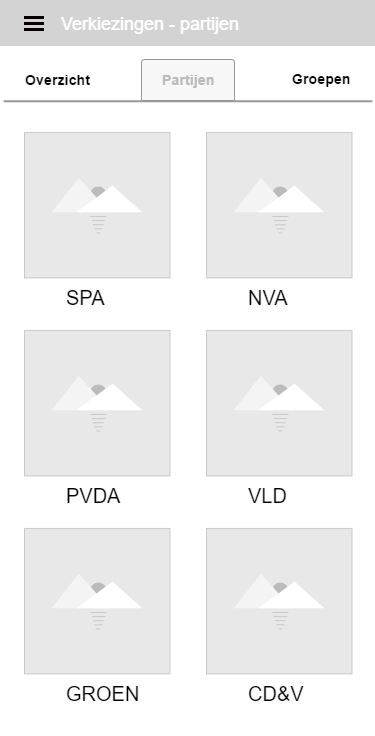
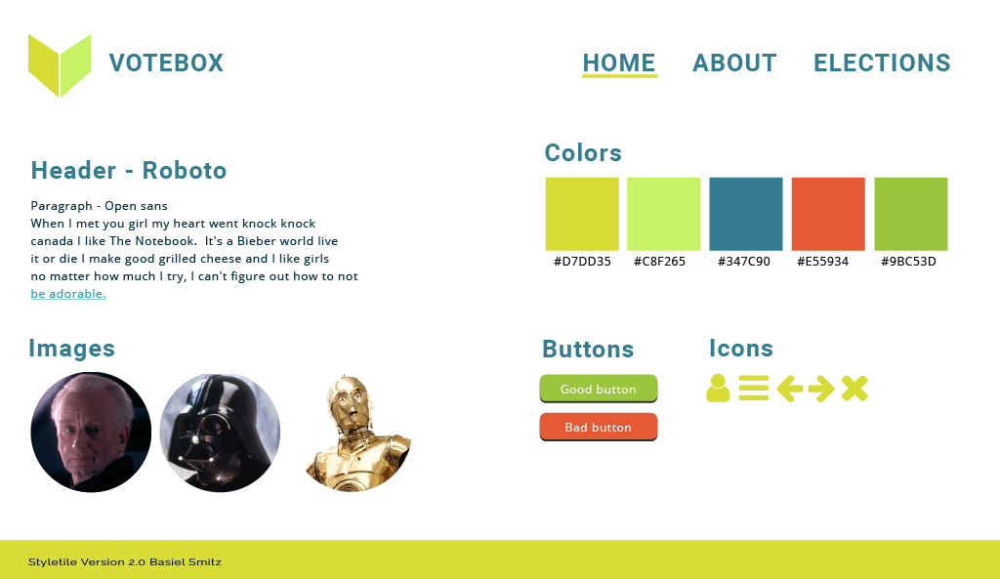
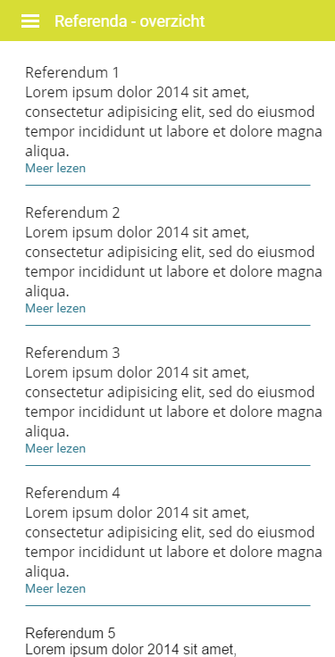

# Inhoudstafel
* [Discover](#markdown-header-discover)
    * [Briefing](#markdown-header-briefing) 
*   [Define](#markdown-header-define)
    *   [Analyse](#markdown-header-analyse)
    *   [Planning](#markdown-header-planning)
    *   [Inspiration](#markdown-header-inspiration)
*   [Design](#markdown-header-design)
*   [Development](#markdown-header-development)
*   [Define](#markdown-header-deliver)
*   [Deploy](#markdown-header-deploy)

# Discover
## Briefing
### Wat wil de opdrachtgever / klant / bedrijf?
De briefing van de docent hield in dat de studenten bekwaam moeten zijn een mobiele applicatie te programmeren in Laravel met behulp van een virtuele omgeving (vagrant - artestead) in groepen van 2. De opdracht heeft als hoofddoel een elektronisch stemsysteem te ontwikkelen die rekening moet houden met zowel:

*   Authenticatie van de kiezer;
*   Privacy zodat de uitgbrachte stem niet terug te traceren is naar de kiezer;
*   Beveiliging van het systeem;
*   Integriteit van de kandidaten.

De applicatie zal vooral gebruikt worden voor verkiezingen.

### Wat is de boodschap?
De applicatie moet gebruikt worden om mensen op een eenvoudigere manier te laten stemmen. Zo kunnen ze zonder het huis uit te gaan hun stem uitbrengen op hun favoriete kandidaat.

### Wie behoort tot het doelpubliek?
Iedere geregistreerde individu in het belgische volksregister die recht heeft om te stemmen ongeacht van het geslacht. Dit wil zeggen: 18 jaar of ouder, beschikt over een belgische nationaliteit, is zijn/haar stemplicht niet ontnomen, …
De eindgebruiker heeft een basiskennis van het internet en technologie.

### Welke informatie is voorhanden?
De partijen zijn bekend (alle partijen van 2017). Voor de rest wordt alle content van scratch geschreven. Afbeeldingen worden gebruikt van het internet. Het kleurgebruik moet neutraal blijven om de eindgebruiker zijn/haar keuze niet te beïnvloeden door een specifieke kleur van een partij te gebruiken. Voor het ontwikkelen van deze applicatie wordt er geen sociale media geïntegreerd. 

### Wat is het budget?
Deze applicatie wordt ontwikkeld binnen een leeromgeving waardoor er geen budget wordt voorzien.

### Wat is de timing?
*   Milestone 1
    *   Productiedossier
        *   Opmaak en vormgeving is klaar
        *   Inhoud is aanwezig maar moet nog aangevuld of geüpdatet worden.

    *   Presentatie
        *   Opmaak en vormgeving is klaar
        *   Inhoud is aanwezig maar moet nog aangevuld of geüpdatet worden.

    *   Timesheets
        *   Ingevuld tot op de respectievelijke datum

    *   Repository
        *   Productiedossier
        *   Presentatie
        *   Timesheet

*   Milestone 2
    *   Eerste functionaliteiten aanwezig en getest
    *   Ruwe versie van de gebruikersinterface
    *   Bijgewerkt op de repository:
        *   Productiedossier
        *   Presentatie
        *   Timesheet

*   Milestone 3
    *   Alle functionaliteiten aanwezig en getest
    *   Gebruikersinterface klaar om te testen
    *   Klaar om door gebruikers getest te worden
    *   Bijgewerkt op de repository:
        *   Productiedossier
        *   Presentatie
        *   Timesheet

*   Milestone 4
    *   Alle functionaliteiten aanwezig
    *   Gebruikersinterface opgepoetst
    *   Klaar voor de “Acceptance Test” door de klant
    *   Definitieve versie op repository:
        *   Productiedossier
        *   Presentatie
        *   Timesheet
# Define
## Analyse
### Functionele specificaties
#### De frontoffice
De applicatie zal worden voorzien van talrijke specificaties. De algemene functionele specificaties houden in dat de gebruiker zich moet registreren om de core van de applicatie te kunnen gebruiken. Deze gebruiker moet hierbij begeleid worden om een foutieve inschrijving te voorkomen. Daarom zal de applicatie voorzien worden van meldingen om de gebruiker te waarschuwen wat hij/zij verkeerd heeft gedaan of aan het doen is. Na het inschrijven kun je jezelf opgeven als kandidaat (als dit van toepassing is voor de gebruiker), als je geen kandidaat bent voor de verkiezing dan wordt jouw rol automatisch ingevuld als kiezer. In de applicatie zijn de volgende rollen van toepassing:
*   bezoeker: is een niet-aangemelde gebruiker
*   kandidaat: gebeurd na het registreren voor kandidatuur
*   kiezer: verplicht om te stemmen bij iedere stemronde
*   kiesbeheerder: admin om alles op te volgen en te beheren

Het spreekt natuurlijk voor zich dat iedere rol zijn eigen toegankelijkheden heeft.
Hieronder vind je een kort overzicht met alle rechten van iedere rol:

#### De bezoeker
De bezoeker heeft op zich geen enkel recht als het op de core van de app aankomt.
Hiervoor moet de bezoeker zich eerst registreren. Na het registreren moet de bezoeker zich aanmelden en wordt de rol van kiezer automatisch toegekend. Als de gebruiker echter lid is van een parlementair comité of dergelijke moet deze gebruiker zich aanmelden als kandidaat om zijn respectievelijke rol aan te vragen. Na het accepteren door de administrators krijg je jouw rol als kandidaat.

#### De kiezer
Na het aanmelden op de applicatie krijgt de gebruiker automatisch de rol van kiezer. Echter bij aanvraag voor het bekomen van kandidaat kan deze rol aangepast worden door de administrators. Eenmaal je ingelogd bent als kiezer heb je het recht om eenmalig een stem uit te brengen op een verkiezing of referendum zolang deze loopt. Na het uitbrengen van een stem krijgt de gebruiker een geanonimiseerde code om zijn uitgebrachte stem later opnieuw op te vragen. Dit wordt gedaan zodat de stemming volledig anoniem gebeurt en mensen niet kunnen achterhalen voor welke partij je hebt gestemd tijdens de verkiezing. Het spreekt dan ook voor zich dat je als rol van kiezer ook de uitslagen van de verkiezing kan raadplegen. Indien de gebruiker zijn gegevens wilt aanpassen ivm zijn profiel is dit perfect mogelijk in de instellingen van de applicatie.

#### De kandidaat
De kandidaat heeft dezelfde rechten als de kiezer met uitzondering dat de kandidaat niet mag stemmen in een verkiezing waar hij zelf aan deelneemt. Daarnaast kan de kandidaat zich kandidaat stellen om mee te doen aan een verkiezing waar de kiezer natuurlijk geen recht op heeft. Daarbovenop kan de kandidaat ook nog aan aanvraag voor een referendum indienen.

De backoffice kent ook enkele verschillende rollen, deze worden later in het dossier besproken.

#### De API
Onze applicatie moet kunnen communiceren met de database, hiervoor gebruiken we een API om de informatie van de database op te halen en weer te geven in de frontoffice. De API werkt ook in de omgekeerde richting en kan input van de frontoffice gaan doorgeven naar de database zodat die op zijn beurt de data kan wegschrijven. De API werkt dus als tussenschakel van de front en backoffice om een goede en veilige communicatie tussen beiden te garanderen. Deze communicatie gebeurd via HTTP requests endus is er sprake van een RESTful API.

#### De backoffice
Net zoals de frontoffice krijgt de backoffice zijn eigen functionele specificaties. In de backoffice krijgen de bevoegde gebruikers het recht om referenda, verkiezingen, gebruikers, … te beheren. Dit hangt ook af van welke rol de gebruiker heeft. De rollen binnen de backoffice bestaan uit:
*   Kiesbeheerder
*   Admin
*   Super-admin

#### Kiesbeheerder
Een kiesbeheerder heeft het recht om verschillende tabellen aan te passen binnen de database. Zo kan hij referenda en verkiezingen beheren. Als een gebruiker zich aanmeld als kandidaat voor een bepaalde verkiezing kan de kiesbeheerder het aanvraag accepteren of weigeren. Dit geldt zowel voor kandidatuur als voorstellen voor verschillende referenda. Daarnaast kan de kiesbeheerder de voorlopige tussenstand via de backoffice volgen. Hij heeft dan ook in zijn macht verkiezingen te stoppen en aan te maken.

#### Admin
Een admin heeft dezelfde rechten als een kiesbeheerder met het enige verschil dat de admin bevoegdheden heeft tot het beheren van de leden en het promoveren van leden naar een kiesbeheerder.

#### Super-admin
Deze gebruiker heeft recht tot alles, inclusief het verwijderen van de database en applicatie.

### Technische specificaties
#### De tools
Bij het ontwikkelen van een webapplicatie horen enkele tools om de development fase te vereenvoudigen. Naast het gebruik van een favoriete text-editor zoals VS Code of PhpStorm worden er ook tools gebruikt voor het designen van de UI/UX en de database. Voor het designen van de applicatie UI/UX en het opmaken van het dossier worden de Adobe programma's gehandhaafd, in het bijzonder:
*   Experience Design
*   Illustrator
*   Photoshop
*   Indesign

Voor het ontwikkelen van de database worden tools gebruikt zoals:
*   MySQL Workbench
*   StarUML

Een goede webbrowser die de laatste functionaliteiten ondersteund is ook van groot belang. Daarom maak je best gebruik van een browser zoals:
*   Mozilla Firefox Developer Edition
*   Google Chrome Canary

#### De ontwikkelomgeving
Om een lokale omgeving op te zetten gebruiken we tijdens de oplossing Artestead, dit is een variant op de homestead die enkele functies bevat met behulp van de artevelde dotfiles. Artestead draait een virtuele omgeving die werkt via Vagrant, door het installeren van VM Virtualbox kan vagrant een virtuele machine creëren. 
Hierbinnen gebeurt de installatie van verschillende benodigdheden zoals PHP en/of homestead (artestead in ons geval).

#### Automatisatie
Voor het installeren van dependencies zal composer gebruikt worden. Via composer kunnen verschillende pakketten gedownload en geïnstalleerd worden om deze te gebruiken in de applicatie. 

#### Serverside specificaties
Serverside worden verschillende technologieën gebruikt. Deze applicatie wordt ontwikkeld in een PHP-framework genaamd: Laravel. De meest recentste versie van Laravel is 5.4. Deze zal dan ook gebruikt worden voor het ontwikkelen van de applicatie. De volgende update (5.5) staat gepland om gereleased te worden in Juli/Augustus dus zal de applicatie niet outdated raken voor de eerste zit. Om door de applicatie te navigeren werkt laravel met een MVC-architectuur. De views worden gemaakt met de Blade syntax en om door de applicatie te navigeren werken de controllers met routing die je naar de juiste pagina navigeren. De database, die minstens 15 tabellen bevat, zal worden ontworpen met laravel en zijn ingebouwde ORM migrations. Hierbij schrijf je de volledige database uit zonder een letter SQL te schrijven, de migrations doen dit helemaal voor ons. Om de database met gegevens te voorzien zullen we gebruik maken van een PHP-bibliotheek genaamd: Faker. 

Om het overzicht te bewaren vind je hieronder een oplijsting van alle technologieën die gebruikt zullen worden aan de serverside.

*   PHP 7.1 of hoger
*   Laravel 5.4 of hoger
    *   Artisan Console
    *   MVC-architectuur
        *   Models met Eloquent ORM
            *   Migrations
            *   Seeding met Faker
        *   Views met Blade Templates
        *   Controllers
            *   Routing met Resource Controllers
*   Carbon
*   MySQL-database via Laravel Eloquent ORM
    *   Minstens 15 1EK | 25 2EK tabellen.
    *   Relaties tussen de tabellen en van elk soort relatie minstens 1 voorbeeld 1EK | 2 voorbeelden 2EK.
*   PHPUnit

#### Clientside specificaties
Voor de clientside worden vooral de gebruikelijke technologieën gebruikt. HTML5 voor de markup, Sass voor de styling en Javascript voor het gedrag van de applicatie. Voor het visualiseren van data maken we gebruik van de D3.js javascript bibliotheek. Deze bibliotheek helpt bij het omzetten van data naar visuele voorstellingen ervan door gebruik te maken van HTML,CSS en SVG’s. Naast D3.js gebruiken we nog het Vue.js framework. Vue is een progressive framework met zijn eigen templating om zo dynamische content via de API weer te geven in de applicatie. Net zoals bij de serverside specificaties voorzien wij hier een korte oplijsting van de clientside specificaties om alles op te helderen:

*   HTML5
*   Sass (SCSS)
*   Vue.js 
*   D3.js
*   Basic Auth 1EK, JWT Bearer Token 2EK

## Inspiration
### Ideaboards
#### Aurelio

#### Basiel

### Moodboard

# Design
## Sitemap
### App

### Backoffice

## Wireframes
### 0.0 Home

### 0.0 Home ingelogd

### 0.1 Navigatie

### 1.0.0 Verkiezingen

### 1.0.0.0 Verkiezing Detail

### 1.0.0.0.0 Stem

### 1.0.0.0.1 Resultaat

### 1.0.1 

### 1.0.1.0 Partij detail

### 1.0.2 Groepen

### 1.1.0 Referenda

### 1.1.1 Referendum nieuw

### 1.1.0.1 Referendum detail

### 1.1.0.2 Referendum resultaat

### 1.2 Login 

### 1.2.0 Registreer 

### 1.3 Account overzicht

### 1.3.0 Account stemmen

## Style Tile

## Visual Designs

### 0.0 Home

### 0.0 Home ingelogd

### 0.1 Navigatie

### 1.0.0 Verkiezingen

### 1.0.0.0 Verkiezing Detail

### 1.0.0.0.0 Stem

### 1.0.0.0.1 Resultaat

### 1.0.1 

### 1.0.1.0 Partij detail

### 1.0.2 Groepen

### 1.1.0 Referenda

### 1.1.1 Referendum nieuw

### 1.1.0.1 Referendum detail

### 1.1.0.2 Referendum resultaat

### 1.2 Login 

### 1.2.0 Registreer 

### 1.3 Account overzicht

### 1.3.0 Account stemmen

# Development
## Database 
### ERD 
